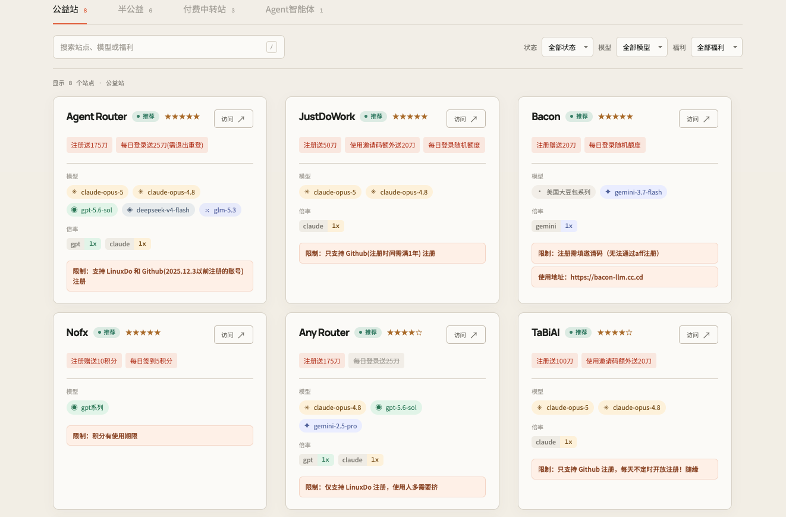

# AI Hop

AI Hop 是一个面向 AI 用户的轻量站点导航页，用于集中查看不同站点的注册福利、支持模型、计费倍率、使用限制和推荐状态。

> 站点信息来自社区整理，福利、开放状态和服务质量可能随时变化。使用或充值前请自行核实。

福利验证时间通过 `benefitVerifiedAt` 记录，当前数据快照统一记录为 2026-09-01；后续重新核验站点福利后，应更新为对应时间。



## 功能

- 按公益站、半公益、付费中转站和 Agent 智能体分类浏览
- 搜索站点名称、模型、福利、限制和备注
- 按推荐状态、模型类型和福利类型组合筛选
- 展示模型标签、计费倍率、福利有效状态和使用限制
- 推荐状态优先排序，同状态下按星级排序
- 卡片在推荐标签下单独展示福利验证时间，并展示福利、模型和使用限制
- 支持 `/` 快捷键聚焦搜索框
- 响应式布局，适配桌面端和移动端
- 外部链接在新窗口打开，并使用安全的 `noopener noreferrer` 配置

## 技术栈

项目使用原生 HTML、CSS 和 JavaScript，不依赖前端框架，也不需要构建步骤。

```text
.
├── index.html              # 页面结构和筛选控件
├── styles.css              # 页面样式与响应式布局
├── app.js                  # 搜索、筛选、排序和渲染逻辑
├── data/providers.js       # 分类、状态和站点数据
├── tests/app.test.mjs      # 核心逻辑测试
└── assets/                 # README 等静态资源
```

## 本地运行

直接启动一个静态文件服务器：

```bash
python3 -m http.server 4173
```

然后访问 `http://localhost:4173`。

页面依赖 Google Fonts。离线或网络受限时，浏览器会回退到系统字体，不影响主要功能。

## 测试

```bash
npm test
```

测试覆盖文本归一化、站点搜索、分类过滤、组合筛选、福利类型变体匹配、福利验证日期格式化、限制信息格式化和推荐排序。

## 维护站点数据

所有站点数据集中在 `data/providers.js` 的 `providers` 数组中。新增或调整站点时，只需修改数据，不需要改动页面结构。

```js
{
  id: 'example',
  name: 'Example',
  url: 'https://example.com',
  category: 'public',
  status: 'recommended',
  rating: 5,
  benefits: ['注册赠送额度', { text: '限时福利', expired: true }],
  models: ['gpt系列', 'claude系列'],
  modelTypes: ['OpenAI', 'Claude'],
  benefitTypes: ['注册赠送'],
  benefitVerifiedAt: '2026-09-01', // 福利验证日期，格式为 YYYY-MM-DD
  rates: [{ model: 'gpt', rate: '1x' }],
  requirements: '限制：注册条件或使用门槛',
  note: '其他补充说明',
}
```

可用分类值：

- `public`：公益站
- `semi-public`：半公益
- `router`：付费中转站
- `agent`：Agent 智能体

可用状态值：

- `recommended`：推荐
- `average`：一般
- `not-recommended`：暂不推荐
- `unknown`：情况未明

## 部署

仓库可直接通过 GitHub Pages 从根目录发布，不需要额外构建产物。仓库启用 Pages 后，默认访问地址为 `https://ai-hop.github.io/`。

## 项目边界

AI Hop 当前只提供静态信息整理和外链导航，不包含登录、评论、用户评分、管理后台、数据库、实时可用率检测或自动监控。
